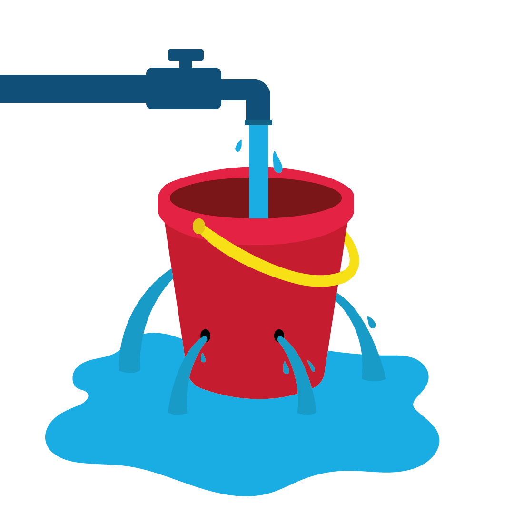

# GA4 E-Commerce Funnel Analyse für den Online-Handel

## Zusammenfassung
Diese Analyse wurde erstellt, um die zentralen Conversion-Hürden in einem E-Commerce-Funnel auf Basis von GA4-Eventdaten sichtbar zu machen. Die Ergebnisse zeigen deutliche Verluste zwischen `view_item` und `add_to_cart` sowie einen zweiten kritischen Einbruch zwischen `begin_checkout` und `add_shipping_info`. Besonders auffällig ist, dass wiederkehrende User mit 4,95 % deutlich besser konvertieren als neue User mit 0,87 %.

## Business Problem
Ziel war es, die größten Conversion-Hürden im E-Commerce-Funnel sichtbar zu machen und zu erkennen, an welchen Stellen Nutzer abspringen.

Die Funnel-Analyse verdeutlicht das Prinzip des 'Leaky Bucket': Bevor Marketing-Budgets zur Traffic-Steigerung erhöht werden, müssen die identifizierten 'Lecks', insbesondere zwischen Produktdetailseite und Warenkorb, geschlossen werden. Durch die Optimierung dieser spezifischen Hürden wird sichergestellt, dass akquirierte Nutzer effizienter zur Conversion geführt werden, anstatt wertvolles Potenzial im Checkout zu verlieren.

## Methodology
Analysiert wurden GA4-E-Commerce-Daten aus BigQuery in einem Jupyter Notebook. Untersucht wurden der Funnel auf Event-, User- und Session-Ebene sowie Drop-offs, Zeit zwischen den Schritten und Unterschiede nach Gerät, Nutzertyp und Land.

## Skills
`BigQuery SQL`, `Python`, `bigframes`, `pandas`, `Plotly`, `Jupyter Notebook`, `Git`

Eingesetzt für SQL-Abfragen, Funnel-Logik, Segmentierung, Drop-off-Berechnung und Visualisierung.

## Ergebnisse & Handlungsempfehlungen
- Größter Verlust im Funnel zwischen `view_item` und `add_to_cart`: nur `16,79 %` der User gehen weiter.
- Zweite kritische Hürde im Checkout zwischen `begin_checkout` und `add_shipping_info`: nur `20,71 %` Step-Conversion.
- Wiederkehrende User konvertieren mit `4,95 %` deutlich besser als neue User mit `0,87 %`.
- Wichtigste Maßnahmen: Produktdetailseite stärken, Checkout vereinfachen und neue User gezielt mit mehr Trust-Elementen und klareren Kaufanreizen aktivieren.

## Next Steps
- A/B-Tests für Produktseiten und Checkout starten
- Funnel zusätzlich nach Session, Kanal und Produktkategorie analysieren
- Dashboard für kontinuierliches Funnel-Monitoring aufbauen
